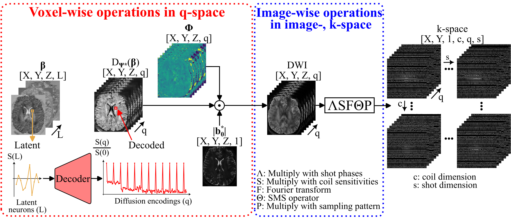

## Reconstruction directory
The script `reconstruction.py` implements following reconstructions:
- MUSE
- LASER
- VAE regularized MUSE
- MUSE + VAE denoising

The LASER reconstruction is implemented with the following forward operator:

  

Modelling the minimization problem:

$$
||y-PΘFSΔ(b_0^{**}D(x))|| - λ||x||_{TV}
$$

  
Click to get meaning of variables

With meaning as:

* $y$ is the k-space data
* $P$ is the undersampling pattern
* $Θ$ is the SMS operator
* $F$ is the forward Fourier transform
* $S$ is the multiplication with coil sensetivities
* $Δ$ is the multiplication with the shot-to-shot phases
* $b_0^{**}$ is the optimized, reconstructed b0 image
* $D$ is the voxel-wise decoding of x
* $x$ are the reconstructed latent images
* $λ$ is the regularization weight
* $||x||_{TV}$ is the TV-norm of the latent iamges

For $b_0^{**}$ the calculation is first:

 -A\mathbf{b_0}\right\|_2^2)

with
* $\mathbf{b_0}$ is a vector containing all 12 $b_0$ images of the acquisition
* $A$ being the MUSE forward operator $PΘFSΔ$

And further calculation of $b_0^{**}$ because $b_0^{*}$ shows artifacts in regions of high phase:

 }&\text{if&space;ang(}b_0^*\text{)}\geq&space;50\text{},\\b_0^*&\text{otherwise.}\end{cases})

To run the reconstructions, you need to adapt the config files  
according to your use-case.  
The shot reconstruction only needs to be run once and only for the LASER  
reconstruction.  
For the denoising using the VAE, the data has to be reconstructed with MUSE first.