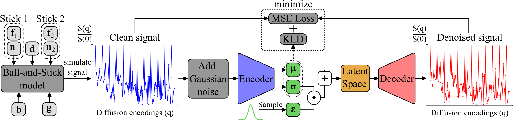

## Training 
This directory implements everything for the training pipeline of our reconstruction method:
- diffusion models ball-and-stick and diffusion-tensor
- signal simulation, dictionary creation and adding of gaussian noise
- variational auto-encoder implementation
- training of DAE to denoise the simulated dictionary

<p align="center">
  
</p>

The diffusion models are implemented in [Dipy](https://dipy.org/) and the  
dictionary simulation can be found in `sim/dwi.py`.

The implementation of the DAE can be found in `models/nn/autoencoder.py`.

The training of the DAE can be run by using the `prototype.yaml` and  
adapting it to your use-case. This yaml then needs to be stored  
in the directory you want the model checkpoint to be saved, let's call  
it "example_dir". And you need to rename this `prototype.yaml` to  
`config.yaml`.  

To now run the training, you need to execute the `train.py` and hand over  
the relative path to `example_dir` from this `training/` directiory.  
If `example_dir` is save in `training/` just type:
```bash
python train.py example_dir
```
and your training should run.