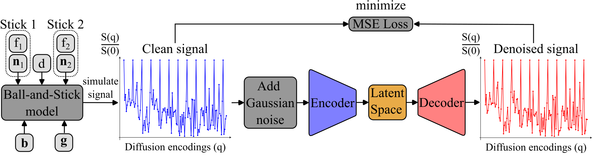

# **⚠️ This repository is under construction! ⚠️**
# Training process

## Training for LASER DAE

  

1. First parameters are fed to the model used for simulation (in this cas Ball-and-Stick with two sticks).
The parameters here are the b-values _b_ and unitary gradient encodings __*g*__ of the sequence, 
as well as the from descritized ranges drawn parameters, the fraction _fx_ and orientation __*nx*__ of stick x
and the diffusivity _d_.

2. To this simulated clean data then Gaussian noise is added.

3. The noisy simulated data is fed to the denoising auto-encoder 

4. Using the output of the network and the clean input signal, a measure of the denoising capability is calculated,
here the mean squared error.

5. Backpropagation and repeat starting at 3

Examples for the diffusion signal models and generation of the dictionary  
as well as the noisy and denoised signals can be found in the `examples.ipynb`