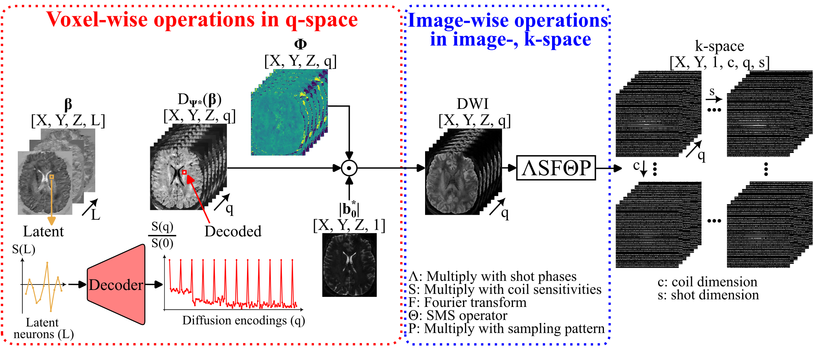

# **⚠️ This repository is under construction! ⚠️**
# Reconstruction forward operator

## Forward operator of LASER

  

The reconstruction minimization Problem is described by 

$$
\lVert
k - P \Theta F S \Delta \big(
  |b_0^{*}| \, D_{\Psi^{*}}(\beta) \, \exp(i\phi^{*})
\big)
\rVert
\;-\;
\lambda \lVert \beta \rVert_{\mathrm{TV}}
$$

With meaning as:

| Symbol                              | Description                             | Domain / Action                |
| ----------------------------------- | --------------------------------------- | ------------------------------ |
| $k$                                 | Acquired k-space data                   | Coil × shot × slice × contrast |
| $P$                                 | Undersampling operator                  | k-space masking                |
| $\Theta$                            | Simultaneous multi-slice (SMS) operator | Slice mixing                   |
| $F$                                 | Forward Fourier transform               | Image → k-space                |
| $S$                                 | Coil sensitivity multiplication         | Image-wise                     |
| $\Delta$                            | Shot-to-shot phase modulation           | Image-wise                     |
| $b_0^{*}$                           | Reconstructed $b_0$ image (optimizable) | Image-wise magnitude           |
| $D_{\Psi^{*}}$                      | Voxel-wise decoder of latent variables  | Latent → contrast              |
| $\beta$                             | Latent images (optimizable)             | Voxel-wise                     |
| $\phi^{*}$                          | Diffusion-encoding phase maps           | Image-wise                     |
| $\lambda$                           | Regularization weight                   | Scalar                         |
| $\lVert \cdot \rVert_{\mathrm{TV}}$ | Total variation (TV) norm               | Spatial regularization         |

The reconstruction is performed by initializing $\beta$ with zeros and minimizing the difference between the measured k-space data $k$ and the forward-model prediction obtained by applying the forward operator to $\beta$.

The decoding operation and the multiplications with $b_0^{}$ and $\phi^{}$ are applied in a voxel-wise manner along the contrast dimension, whereas all remaining operations are applied in an image-wise manner.

[//]: <> (Examples for the reconstruction can be found in the `examples.ipynb`)