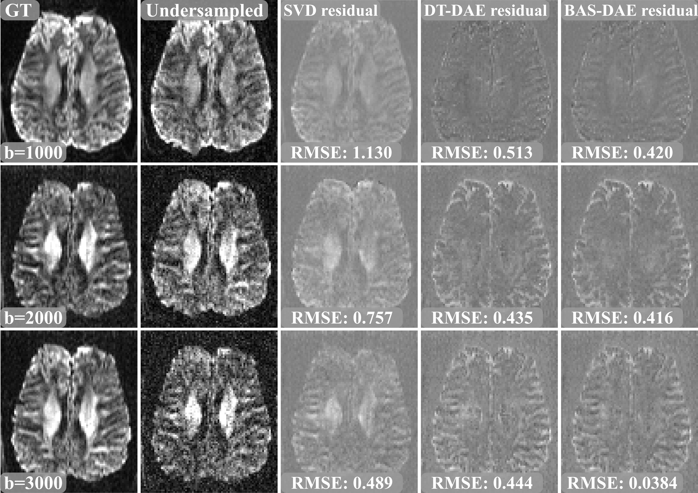

# **⚠️ This repository is under construction! ⚠️**
# Denoising experiment

  

First, the fully sampled low resolution, two times averaged dataset gets reconstructed using parallel imaging and considered as ground truth (GT).

Second, one of the subsets (one of the two acquisitions) gets three times undersampled by keeping only every third k-space line and reconstructed using parallel imaging (Undersampled)

Third, the undersampled, reconstructed dataset gets denoised with three methods:

* Singular value decomposition of the data and keeping only the 11 largest singular values (linear approach)
* Denoising with a denoising auto-encoder, trained with simulated diffusion tensor model data (non-linear approach)
* Denoising with a denoising auto-encoder, trained with simulated ball-and-stick model data (non-linear approach)

The residuals, difference between the resulting denoised images and the ground truth, are shown in the presented figure. The residuals suggest that the non-linear subspace is able to better model the noisy diffusion signals and reduce the noise without loss of contrast.

Fully sampeld data can be received upon request.