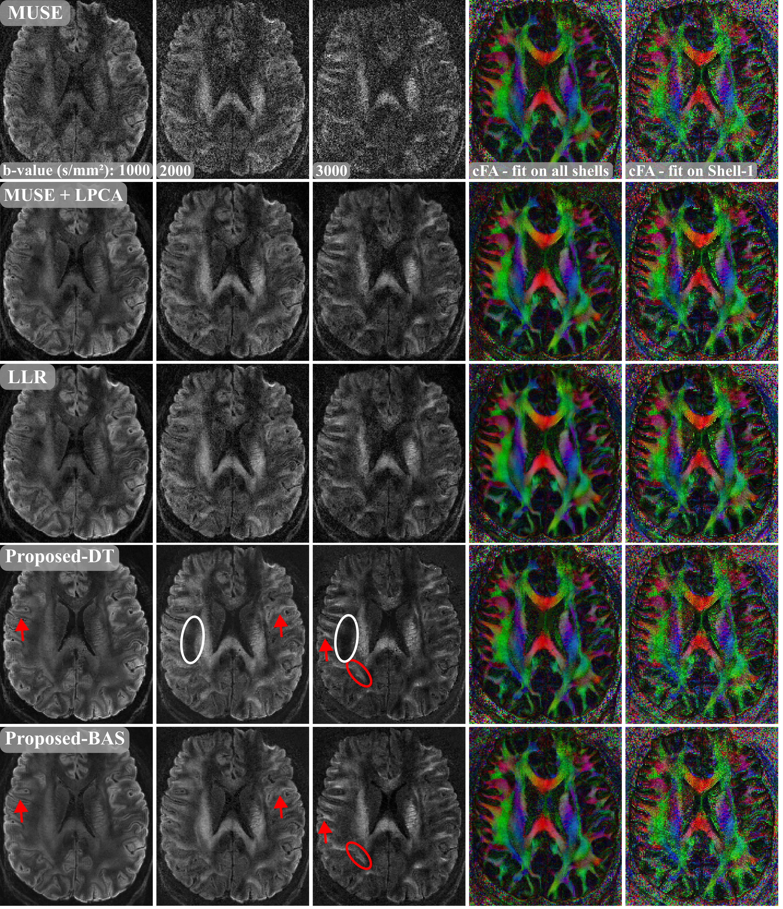

# **⚠️ This repository is under construction! ⚠️**
# In this folder the figure to compare differnet reconstruction techniques can be plotted

## Comparison of the reconstructions

  

The high resolution dataset was reconstructed using the following methods:

* MUSE reconstruction
* MUSE+LPCA denoising
* LLR-regularized reconstruction 
* Proposed reconstruction with the DT-trained DAE (Proposed-DT)
* Proposed reconstruction with the BAS-trained DAE (Proposed-BAS)

Diffusion tensors were fitted once with all b-values in an attempt to include all data in the analysis and once only with b=1000 s/mm² (Shell-1) data, which is physically more reasonable, since the diffusion tensor and the derived FA is defined in the low b-value limit. For this, the proposed reconstruction was rerun only on Shell-1, because an analysis of a data-subset is not possible with our joint reconstruction.  

The reconstruction results are depicted here. MUSE reconstructions show substantial noise corruption that increase with the b-value. MUSE+LPCA and LLR reconstructions show a higher SNR than MUSE for all three depicted b-values at the cost of blurring. The proposed reconstructions show more details and higher SNR for the depicted b-values compared to the other reconstructions. For example, U-fibers become better visible (red arrows). Some contrast differences between DT and BAS images are noticeable.
The cFA fit on all shells looks comparable for all reconstruction, but LLR and MUSE+LPCA exhibit some smoothing. The cFA fit only on Shell-1 shows the best for LLR and LPCA denoised MUSE, proposed reconstructions and MUSE showing rather noisy results.

To reproduce the results, the data can be requested and the reconstructions run with the proposed repository and the get_images.py script can be executed.