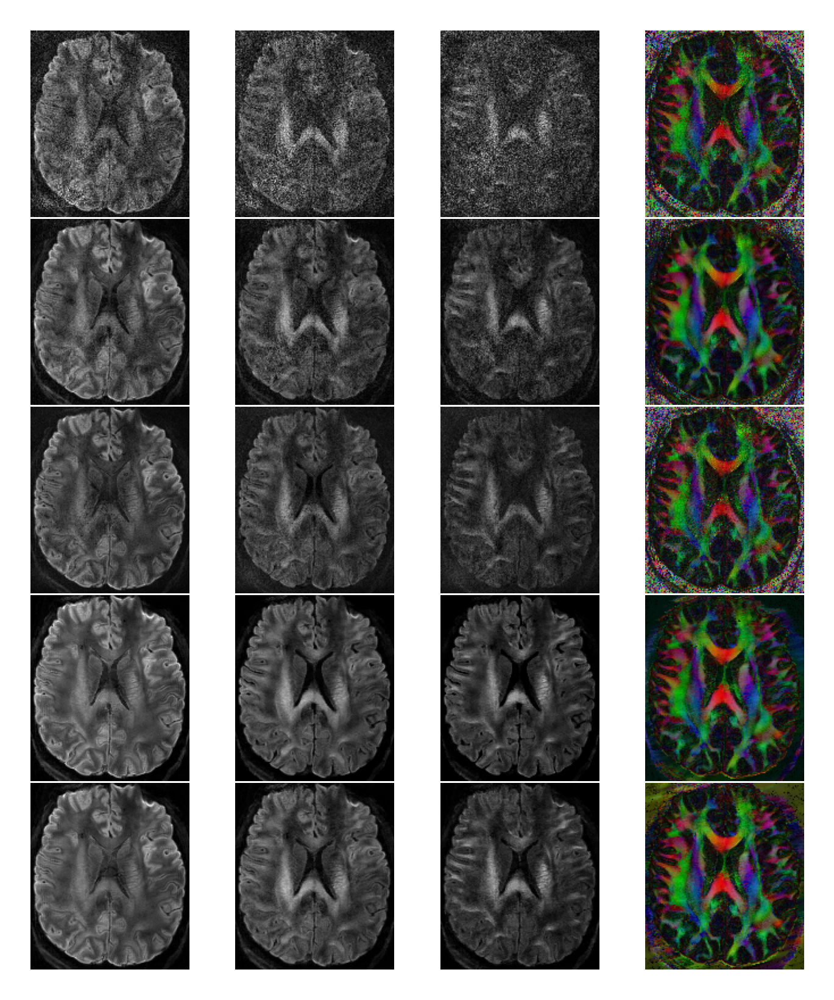

# **⚠️ This repository is under construction! ⚠️**
# In this folder the figure to compare differnet reconstruction techniques can be plotted
The depicted results suggest that LASER is superior compared to LLR in regards of detail conservation. The SNR is increased compared to MUSE. VAE as a denoiser is missing some kind of consistency and leads to differences in contrast.

## Comparison of the reconstructions

  

