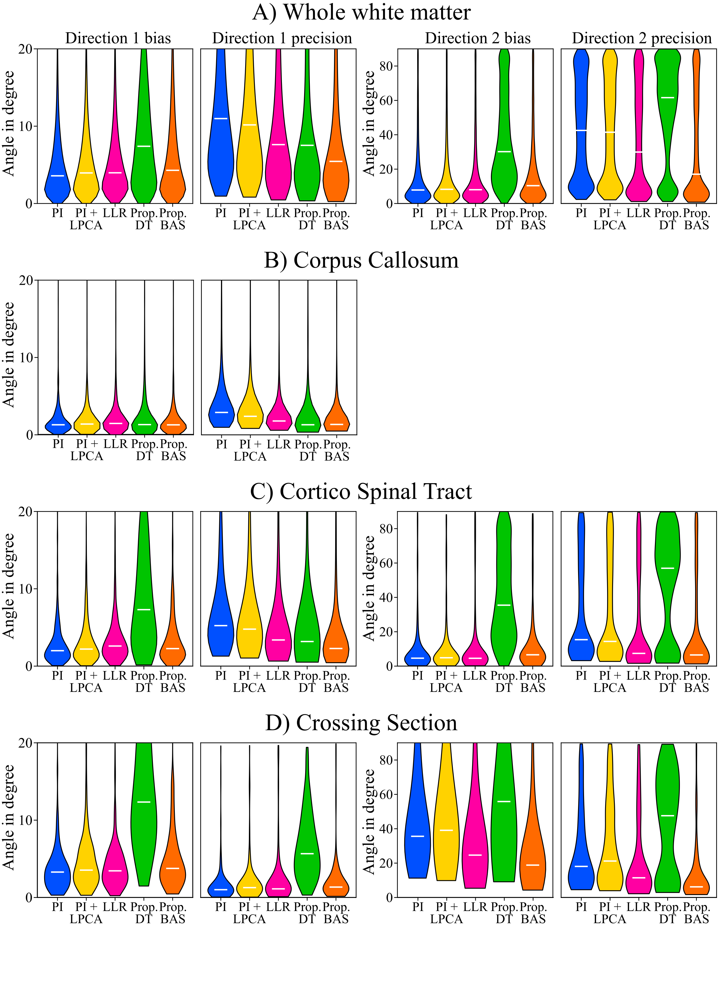

# **⚠️ This repository is under construction! ⚠️**
# Bootsrap experiment

For investigation of potential bias in the proposed reconstruction technique, a bootstrapping experiment was performed. For that purpose, the averaged LR dataset was used. 

The two averages were split, resulting in two independent datasets (LR1 and LR2). These were then retrospectively three-fold undersampled (keeping only every third k-space line) and reconstructed using parallel imaging (PI), PI+LPCA denoising, LLR, and the proposed reconstructions. LLR, Proposed-DT and Proposed-BAS hyperparameters were adapted because of the larger voxel-size  (LLR: block-shape adapted to (3,3), Proposed: TV-weight adapted to 0.01). 

Then 1,000 bootstrap samples were created by randomly selecting either the LR1 or LR2 image for every diffusion direction. For reference, the fully sampled, averaged, PI reconstructed dataset was used. fODFs were estimated for all bootstrap samples using multi-shell multi-tissue constrained spherical deconvolution, implemented in MRtrix3. From the fODFs, the two main fiber directions were extracted in each voxel. 

Using the mean dyadic tensor approach (further information provided in the support material), bias and precision (95-th confidence interval) from the bootstrapping experiment for the two main directions in each voxel were calculated. Only fODFs with a peak above an empirically determined threshold were considered for the analysis. The assignment of the two fiber directions obtained in a bootstrap to those of the full dataset was made by choosing the assignment with the lower difference angle. The bias and precision were evaluated in the whole white matter and in three manually selected areas: Corpus Callosum (CC), Cortico Spinal Tract (CST), and a crossing section (CS) between CC and CST. 

<p align="center">
  
</p>

The figure shows violin plot results for the bias and precision for direction 1 and direction 2 for the white matter, CC, CST, and CS. Additionaly the ROIs_bias_precision_quartiles.xlsx shows the values for the 1st, 2nd, and 3rd quartile for each region of interest.


PI overall shows the smallest bias, but all methods perform similarly besides proposed-DT. For precision, Proposed-BAS shows the best results over all areas and LLR was slightly better than PI and PI+LPCA, while Proposed-DT performed worst.

# Reproduction
Run the scripts in the code/laser/bootsrapping directory
Run the script 

```bash
python create_violin_plots.py
```

If not all slices were used, the masks may have to be adapted.