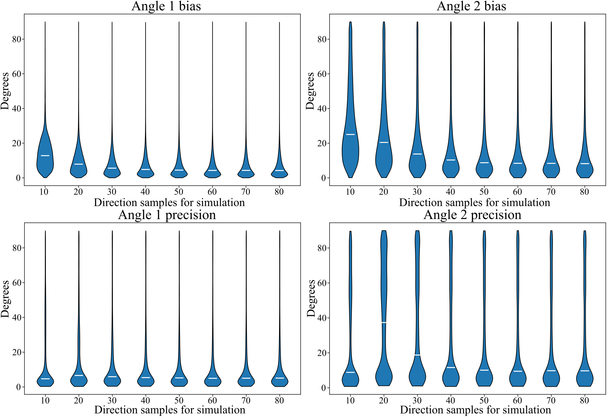

# **⚠️ This repository is under construction! ⚠️**
# Fiber direction samples in training ablation

As the main variable for the size of the simulation dataset is the number of directional samples to simulate diffusion signal curves, we investigated the performance for the bias and precision analysis for models trained with different number of drawn samples. The samples contribute to the size of the training data by a multiplication with N × (N-1), so the larger the number of samples, the larger the training set. The other training and network parameters were again the same as in chapter 2.2. In this support figure, the results for the bias and precision analysis are shown. These show that the potential bias is reduced to a minimum if the dataset is large enough (≥ 50 sample directions), but the training time increases the more samples are drawn, so that sample directions (≥70 upwards) do not justify their use.

  

