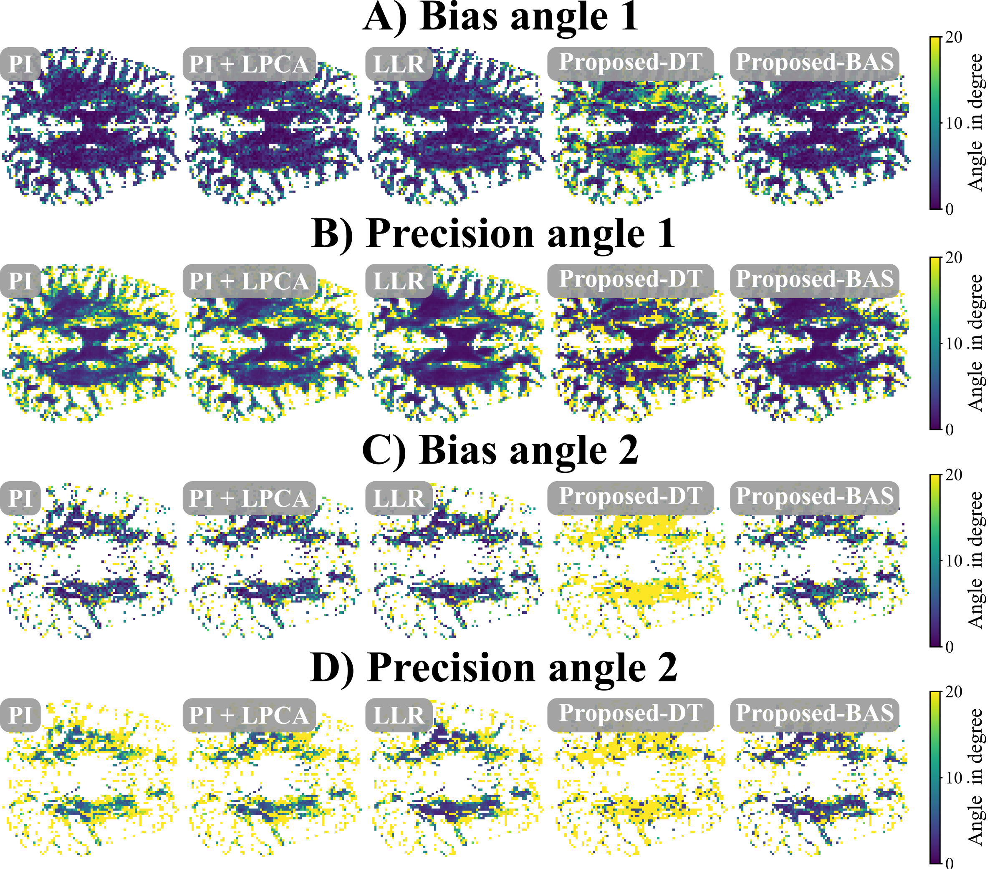

# **⚠️ This repository is under construction! ⚠️**
# Images of the bias and precision for a certain slice

In this supporting figure, bias and precision of the fiber orientation analysis are displayed for one slice. The bias is similar for all reconstruction for the first direction, but the proposed method using the DT model. The precision seems higher for the proposed reconstruction which also visually show less noise, and highest for Proposed-BAS. For the second angle, the results are similar to the first direction, only Proposed-BAS seems to have a slightly higher bias and the Proposed-DT results are worst by far. The precision seems to be the same as for direction 1 and Proposed-BAS shows the best results, Proposed-DT the worst.

  

