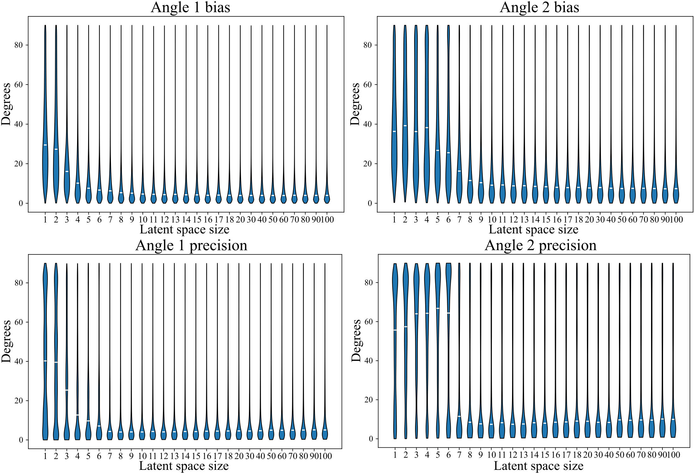

# **⚠️ This repository is under construction! ⚠️**
# Latent-space size

As the optimal latent-space size was not evident a priori, multiple models with different latent-space sizes were trained. Their performance in testing with the simulated dataset did not directly relate to their reconstruction performance. The bias and precision analysis were performed for these different models and the results are shown in the following figure. These values did not change substantially for latent-space sizes larger than 9. Eventually, we chose a little larger latent-space size of 11.

  

