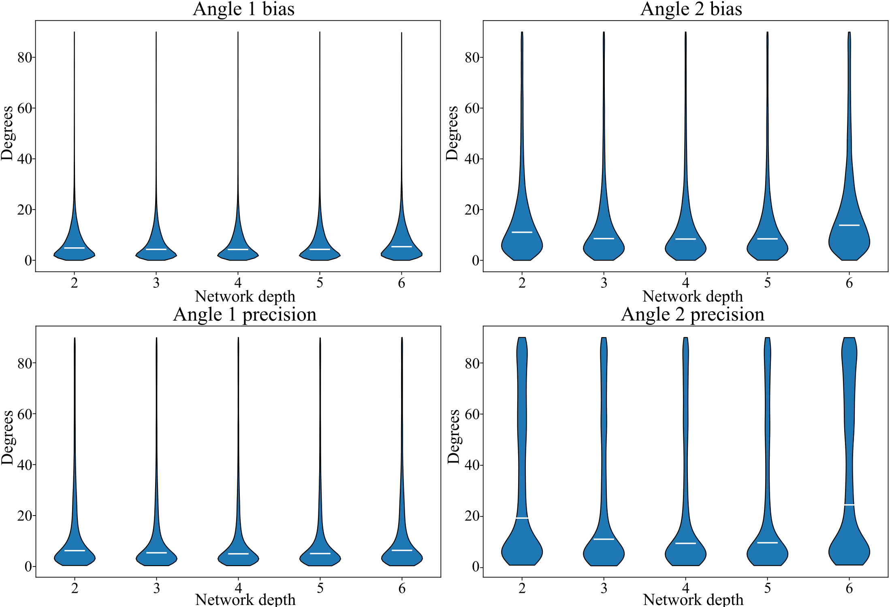

# **⚠️ This repository is under construction! ⚠️**
# Network depth (number of encoding and decoding layer)

To analyse the influence of the network depth, multiple models were trained with a latent-space size of 11 for 100 epochs with the simulation data from chapter 2.2. Their performance in testing of the network did not directly relate to their reconstruction performance. Again, the bias and precision analysis was performed for different models and is visualized in the following figure. As the precision and bias values do not change significantly upon depths larger than 2, we agreed eventually chose a depth of 4. Higher depths have more trainable parameters and therefore the performance can decrease if the same dataset is used for the same number of epochs, but we would not expect a gain in performance if a network with depth of 6 would be trained even longer. 

  

