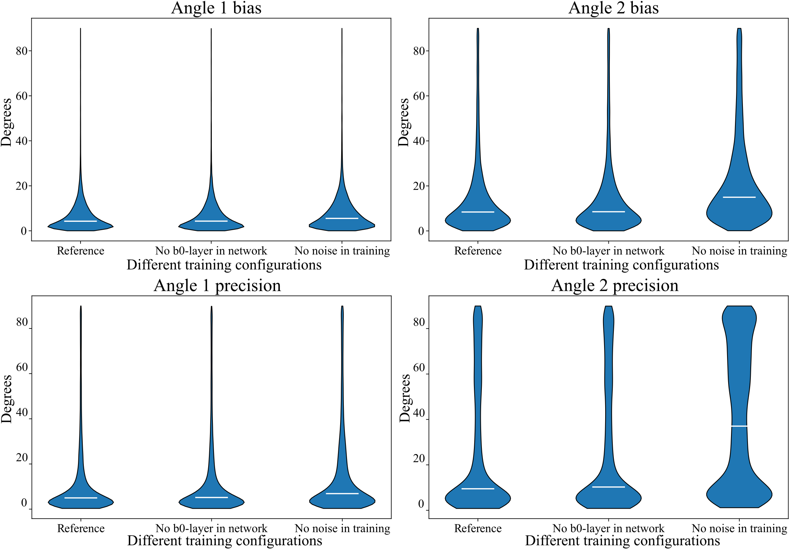

# **⚠️ This repository is under construction! ⚠️**
# No noise in training or no b0-layer in network

Here we present two more network training configurations. Once the noise of the simulated training data was set to zero and once no b0-layer was used (which scales the b0 entries to 1 automatically). The results for the bias and precision analysis are visible in following figure together with the reference (configuration used in chapter 2.7). While the benefit of the b0-layer is almost invisible in this configuration, the reconstruction definitely benefits from noise during training.

  

