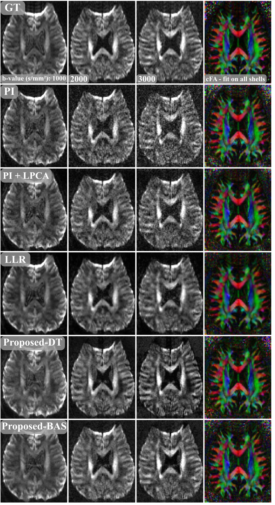

# **⚠️ This repository is under construction! ⚠️**
# Reconstruction comparison LR dataset 

In the figure below, we show the reconstruction comparison for the LR datasets, which are used for the bias and precision analysis in chapter 2.7. Here, “ground truth” (GT) is the averaged, fully sampled scan, reconstructed with PI. The other reconstructions are based on the retrospectively 3-fold undersampled scan. Proposed-DT and Proposed-BAS are less noisy than the PI images and sharper than the LLR images.

  

